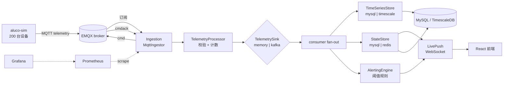

# Aluco 物联网设备监控平台

[](https://github.com/zlzpic/aluco/actions/workflows/ci.yml)


语言：**[English](README.md)** · 简体中文

> **Aluco**（乌拉尔猫头鹰）——开源的物联网设备车队监控平台。
> 设备通过 MQTT 上报遥测，平台实时完成摄取、存储、阈值判断与可视化。

```
设备 → MQTT (EMQX) → aluco-server (Spring Boot) → MySQL + WebSocket → React 前端
```

## 目录

1. [架构](#架构)
2. [为什么这样选（取舍）](#为什么这样选取舍)
3. [快速开始](#快速开始)
4. [端口一览](#端口一览)
5. [默认账号](#默认账号)
6. [验收清单](#验收清单)
7. [已知取舍与限制](#已知取舍与限制)
8. [开发](#开发)
9. [许可证](#许可证)

---

## 架构

### 组件

| 组件 | 技术 | 职责 |
|---|---|---|
| **aluco-server** | Spring Boot 3.4 / Java 21 | REST API · WebSocket · MQTT 摄取 · 告警引擎 |
| **aluco-sim** | Java CLI（Paho + picocli） | 设备车队模拟器 |
| **aluco-web** | React 18 + TypeScript + Vite 5 | 监控大屏 |
| **EMQX** | 5.8.x | MQTT broker |
| **MySQL** | 8.4 | 主存储 |
| **Redis** | 7.x | *（Phase 2 — 可选）* 设备状态缓存 |
| **Kafka** | 3.9 KRaft | *（Phase 2 — 可选）* 遥测边缘缓冲 |
| **TimescaleDB** | 2.17 on PG 16 | *（Phase 2 — 可选）* 时序存储 |
| **Prometheus** | v2.55 | 指标抓取 |
| **Grafana** | 11.x | 可观测性看板 |

### 数据流



<details>
<summary>ASCII 版本</summary>

```
aluco-sim ──MQTT──▶ EMQX ◀──telemetry / cmdack──▶ aluco-server ──cmd──▶ EMQX
                                                    │
                       consumer fan-out             │
              ┌───────────────────┬─────────────────┴───────┐
              ▼                   ▼                         ▼
        TimeSeriesStore      StateStore               AlertingEngine
       (mysql|timescale)    (mysql|redis)             (规则状态机)
              │                   │                         │
              └──────▶ MySQL ◀────                         │
                     (telemetry · device_state · alert_event)│
                                                    WebSocket ─▶ aluco-web
              Prometheus ◀──scrape── aluco-server ──▶ Grafana
```

</details>

### 服务端包结构

```
com.aluco.server
├── alerting/      # 规则引擎 · AlertEvent/Rule 服务
├── api/           # REST 控制器 · 鉴权 · 异常处理
├── device/        # 设备 CRUD · StateStore · 离线检测
├── ingestion/     # MQTT 客户端 · 命令下发
├── processing/    # 遥测处理 · Sink · TimeSeriesStore
├── push/          # WebSocket 处理器 · LivePush
└── common/        # 共享 DTO · EnvelopeCodec · JwtService
```

---

## 为什么这样选（取舍）

个人项目要把复杂度预算花在学习收益最高的地方。下表中每个选择都是刻意的，**包括它带来的代价**。细节见 `docs/adr/`。

| 决策 | 理由 | 付出的代价 | ADR |
|---|---|---|---|
| 用 MQTT + EMQX，而不是自研 broker 或裸 TCP | IoT 事实标准：为受限设备设计的小帧、离线会话、LWT、百万连接扩展性；broker 吸收连接生命周期，应用层对设备保持无状态 | 栈里多一个组件；鉴权语义交给 broker 配置 | ADR-0001 |
| **模块化单体**，边界由 ArchUnit 强制 | 只有一个维护者，微服务的运维税扛不住。包（`ingestion/ processing/ device/ push/ api/`）之间的依赖方向被测试锁死，日后拆分是重构而非重写 | 热点路径无法独立扩容；一次坏部署的爆炸半径是整个应用 | ADR-0002 |
| **三个存储接缝**，全部 opt-in（`TelemetrySink`、`StateStore`、`TimeSeriesStore`） | Day-1 完全跑在 MySQL 上；Redis / Kafka / TimescaleDB 各自只替换一个接缝，改一个配置项即可切换。演进由压测数据驱动，而不是由潮流驱动 | v1 demo 用不到的间接层；每个接缝都要维护两份实现和两套测试 | ADR-0009/0010/0011 |
| Redis 离线检测用 **ZSET 按分数扫描**，不用 keyspace 过期 | Redis 的过期事件是 best-effort（高负载下会丢）——监控平台不能漏状态变更；对 `aluco:last_seen` 做 `ZRANGEBYSCORE` 是确定性的，代价只与命中数相关 | 最长 15 s 的检测延迟（扫描周期），对比近似即时的过期通知 | ADR-0010 |
| 遥测放 TimescaleDB，但 **MySQL 仍是元数据的记录系统** | 遥测是追加写 + 时间窗查询：hypertable 分块、`?interval=` 背后的连续聚合、7 天压缩，正好是这类负载。元数据小、关系型、要事务——MySQL 够用且早已部署 | 多一个数据源、多一份 Flyway 历史；双引擎运维 | ADR-0011 |
| Kafka 只在 **撞上写入墙之后**作为边缘缓冲 | `acks=all` + 幂等生产者 + DLQ 换来可回放摄取，但只有超过实测写入上限才划得来；默认的内存 sink 有界且零依赖 | 多一条只有压测场景才会走到的代码路径（Kafka consumer） | ADR-0009 |
| v1 用最朴素的窄表 `telemetry`，**不分区** | “day-1 最合理设计”：先量出真实上限，让压测数据来决定要不要迁移，而不是提前优化 | 已知吞吐上限；已记录，且是主动接受的 | ADR-0004 |
| React 18 + ECharts，不做 SSR | 大屏是登录后的 SPA；ECharts 原生处理流式时序；Vite 让构建保持无聊 | SEO 与首屏服务端渲染——在登录墙后面没有意义 | — |

---

## 快速开始

### 前置条件

- Docker Engine 20.10+ 与 Docker Compose v2
- **或** WSL2 Ubuntu 22.04 + 原生 MySQL、EMQX、JDK 21（见[开发](#开发)）

### 一条命令起 demo

```bash
cd deploy
docker compose --profile demo up -d --build   # MySQL、EMQX、server、web、Prometheus、Grafana + 200 台模拟设备
# `up -d` 会等到 server 通过健康检查才返回（模拟器挂在同一个门控上，
# 所以设备注册不会抢在 API 就绪之前），然后打开 http://localhost
```

> 首次运行会拉取约 1.5 GB 基础镜像并构建三个模块（Maven/npm 都在容器里跑）。
> 自带的 MySQL 故意只在宿主机暴露 `127.0.0.1:3307`，这样本机已装 MySQL 也能干净起栈；
> 容器内部仍然走 `mysql:3306`。

### v2 Phase 1 — 命令回执与 EMQX 鉴权

demo 默认使用匿名 MQTT。要把 broker 切到凭证模式：

```bash
EMQX_ALLOW_ANONYMOUS=false docker compose up -d   # 在 deploy/ 下执行
```

之后 server 会在设备注册 / 轮换 / 删除时，把 EMQX 内置凭证库与设备表保持同步
（用户名为 `deviceKey`，密码为 `token`），实现见 `EmqxAuthService`；v1 采用匿名的原始决策记录在 ADR-0003。
注意：`aluco-sim` 目前仍是匿名连接，所以模拟器只能驱动匿名模式的 broker（见「已知取舍与限制」）。

**v2 Phase 1 能力：**
- ✅ **命令回执**：设备在 `cmdack` 主题应答；server 跟踪 SENT → ACKED / FAILED / TIMEOUT
- ✅ **EMQX 鉴权**：`deviceKey` 作用户名、`token` 作密码；server 通过 EMQX REST API 同步凭证
- ✅ **令牌轮换**：`POST /devices/{key}/token/rotate` 立即作废旧 token
- ✅ **命令超时**：30 s 超时监控（`ALUCO_COMMAND_TIMEOUT` 可配）

### v2 Phase 2 — Kafka / Redis / TimescaleDB（可选，默认关闭）

```bash
# 启用 Kafka sink（需要已在跑的 Kafka 3.9 KRaft）
java -jar aluco-server.jar --aluco.sink.type=kafka --aluco.kafka.bootstrap-servers=localhost:9092

# 启用 Redis 状态存储（需要已在跑的 Redis 7）
java -jar aluco-server.jar --aluco.store.state=redis --aluco.redis.url=redis://localhost:6379

# 启用 TimescaleDB 时序存储（需要 PG 16 + TimescaleDB 2.17）
java -jar aluco-server.jar --aluco.store.timeseries=timescale --aluco.timescale.jdbc-url=jdbc:postgresql://localhost:5432/aluco
```

> ⚠️ **Phase 2 是 opt-in。** 默认配置为内存 sink + MySQL。迁移理由见 [docs/adr/](docs/adr/)，压测数据见 [docs/benchmarks/](docs/benchmarks/)。

### 启动模拟器

```bash
# 起 200 台模拟设备（demo profile，自动通过 REST 注册）
docker compose --profile demo up -d sim

# 查看模拟器日志
docker compose logs -f sim

# 只停模拟器（用来观察离线判定）
docker compose stop sim
```

### 首次登录

1. 打开 **http://localhost**
2. 用 `admin` / `admin123` 登录
3. 进入**设备**页——应能看到模拟器注册好的约 200 台设备
4. 进入**规则** → **新建规则**：`temp GT 30`（全部设备）
5. 盯着**告警**页——模拟器注入温度尖峰后，告警会陆续出现

---

## 端口一览

| 端口 | 服务 | 用途 |
|---|---|---|
| `80` | web (nginx) | 监控大屏 |
| `8080` | aluco-server | REST API · WebSocket |
| `3307`（仅 127.0.0.1） | MySQL 8.4 | 主库（宿主机调试用；容器内走 `mysql:3306`） |
| `1883` | EMQX | MQTT（设备侧） |
| `18083` | EMQX Dashboard | broker 管理界面 |
| `9090` | Prometheus | 指标 |
| `3000` | Grafana | 看板 |

---

## 默认账号

| 系统 | 用户名 | 密码 | 说明 |
|---|---|---|---|
| Aluco Web | `admin` | `admin123` | 种子数据，上线前必须改 |
| EMQX Dashboard | `admin` | `public` | 镜像默认值，请立即修改 |
| Grafana | `admin` | `admin` | 首次登录会提示修改 |

> ⚠️ **以上凭据仅用于本地开发，严禁用于生产环境。**

---

## 验收清单

执行 `docker compose --profile demo up -d --build` 后，逐项确认：

- [ ] **页面可访问** http://localhost —— 登录成功
- [ ] 设备列表出现 **200 台设备**（模拟器已自动注册）
- [ ] 设备详情页的**实时曲线**在滚动（WebSocket `telemetry` 帧）
- [ ] 规则 `temp GT 30` 在尖峰注入后 90 s 内产生 FIRING 告警，并且随后跟来对应的
      **RESOLVED（恢复）**提示——告警恢复是服务端推送的，不只是轮询
- [ ] **告警确认（ACK）**后，告警列表状态变为 ACKED
- [ ] **设置上报间隔**命令能下发并被确认：
      `POST /api/v1/devices/{key}/commands/set-interval`，随后
      `GET /api/v1/devices/commands/{cmdId}` 显示 `SENT` → `ACKED`（含 `ackedAt`）
- [ ] 无遥测约 60 s 后**设备转为离线**（`docker compose stop sim`，观察
      `aluco_offline_flips_total` 与在线徽标）；`docker compose start sim` 后恢复在线
- [ ] **Grafana Aluco 看板**（http://localhost:3000，provisioning 自动加载）中
      `aluco_ingest_received_total` 速率 > 0，且 `aluco_e2e_latency_seconds` 直方图有数据

笔记本实测（Docker Desktop，200 台设备 @ 1 s）：摄取约 200 msg/s 且
`result="dropped" = 0`，端到端 p95 ≈ 40 ms，命令往返 ≈ 20 ms。

---

## 已知取舍与限制

| 限制 | 当时的理由 | 计划如何收口 |
|---|---|---|
| EMQX 凭证模式没有端到端跑通 | 服务端凭证同步已存在（`EmqxAuthService`），但 `aluco-sim` 仍匿名连接，所以 demo 保持 `EMQX_ALLOW_ANONYMOUS=true` | 给 aluco-sim 加上设备凭证鉴权，再把 compose 默认值翻过来 |
| 命令回执 | v1 没有设备侧应答 | **v2 ✅**：`cmdack` 主题 + 命令表 + 30 s 超时监控；Web UI 还没有渲染 `command` 这个 WS 帧（后端与 API 已完备） |
| Kafka sink 逐条写入 | `KafkaTelemetryConsumer` 仍是每条调用 `writeBatch` + 状态 upsert，没有内存 sink 那样的缓冲 | consumer 路径同样做批量，然后重跑 ADR-0009 的对比压测 |
| 单实例部署 | v1 定位是模块化单体 | v3+：按演进需要再拆微服务 |
| 默认只用 MySQL | day-1 朴素设计 | **v2 ✅**：TimescaleDB 迁移路径已就绪（默认关闭） |
| `telemetry` 窄表（未分区） | 容量上限留给压测决定 | v2：实测阈值触发分区方案 ADR |
| Kafka / Redis（可选） | v1 基线用内存 sink | **v2 ✅**：TelemetrySink（Kafka）与 StateStore（Redis）可插拔——默认关闭，配置开启 |

---

## 开发

### 源码构建

```bash
# 构建 server
cd aluco-server
./mvnw clean package -DskipTests

# 构建模拟器
cd aluco-sim
mvn clean package

# 构建前端
cd aluco-web
npm install && npm run build
```

### 跑测试

```bash
cd aluco-server
./mvnw test           # 单元测试 + ArchUnit
```

### 环境变量

所有敏感值都可通过环境变量配置，默认值面向 localhost。

| 变量 | 默认值 | 用途 |
|---|---|---|
| `ALUCO_DB_URL` | `jdbc:mysql://localhost:3306/aluco` | MySQL JDBC URL |
| `ALUCO_DB_USER` | `root` | 数据库用户名 |
| `ALUCO_DB_PASSWORD` | 本地 `123456` · compose 里 `root` | 数据库密码 |
| `ALUCO_MQTT_BROKER` | `tcp://localhost:1883` | EMQX 地址 |
| `ALUCO_JWT_SECRET` | *（开发占位值）* | HMAC 密钥——**上线务必覆盖** |
| `ALUCO_EMQX_API_BASE` | `http://localhost:18083` | EMQX REST API 基址（compose 设为 `http://emqx:18083`） |
| `ALUCO_EMQX_API_USER` | `admin` | EMQX REST API 用户（凭证同步） |
| `ALUCO_EMQX_API_PASSWORD` | `public` | EMQX REST API 密码 |
| `ALUCO_SINK_TYPE` | `memory` | `memory` / `kafka`——遥测 sink 后端（Phase 2） |
| `ALUCO_STORE_STATE` | `mysql` | `mysql` / `redis`——设备状态后端（Phase 2） |
| `ALUCO_STORE_TIMESERIES` | `mysql` | `mysql` / `timescale`——时序后端（Phase 2） |
| `ALUCO_KAFKA_BOOTSTRAP_SERVERS` | `localhost:9092` | Kafka bootstrap（Phase 2） |
| `ALUCO_REDIS_URL` | `redis://localhost:6379` | Redis 连接串（Phase 2） |
| `ALUCO_TIMESCALE_JDBC_URL` | `jdbc:postgresql://localhost:5432/aluco` | TimescaleDB JDBC URL（Phase 2） |
| `ALUCO_TIMESCALE_USERNAME` / `_PASSWORD` | `postgres` / *（空）* | TimescaleDB 凭据（Phase 2） |

### 模拟器命令行

```bash
# 先构建（jar 不入库）：cd aluco-sim && mvn -q package
java -jar aluco-sim/target/aluco-sim-1.0.0.jar [options]

# 常用参数
--devices 1000                 # 模拟 1000 台设备
--interval 1s                  # 每台设备每 1 秒上报一次
--ramp 60s                     # 在 60 秒内错峰启动
--metrics temp,humidity        # 要模拟的指标
--spike-probability 0.01       # 每条数据 1% 概率注入尖峰
--seed-devices true            # 自动通过 REST 注册设备（默认开）
--ack-drop-probability 0       # v2：0~1，故意丢弃 cmdack 的概率（用来演示 TIMEOUT 路径）
--api http://localhost:8080/api/v1   # 自动注册所指向的 server REST
--username admin --password admin123 # 注册用的登录凭据
```

> **说明：**模拟器目前匿名连接 broker（当前版本没有 `--auth` 参数）；凭证模式路线见「已知取舍与限制」。

---

## 可观测性

### Prometheus 指标

| 指标 | 类型 | 含义 |
|---|---|---|
| `aluco.ingest.received` | Counter | 收到的原始 MQTT 消息（标签：`result` 为 `ok` 或 `dropped`） |
| `aluco.sink.dropped` | Counter | 队列溢出丢弃数 |
| `aluco.e2e.latency` | Timer（直方图） | 从信封 `ts` 到处理完成的端到端耗时 |
| `aluco.persist.batch.size` | DistributionSummary | 批量写入的批大小 |
| `aluco.rule.eval` | Timer | 单条规则的评估耗时 |
| `aluco.ws.sessions` | Gauge | 活跃 WebSocket 会话数 |
| `aluco.alerts.firing` | Gauge | 当前处于 FIRING 的告警事件数 |
| `aluco.kafka.lag` | Gauge | **v2** Kafka consumer 积压（已分配分区求和） |
| `aluco.emqx.sync.failures` | Counter | **v2** EMQX 凭证同步失败次数 |
| `aluco.command.timeout` | Counter | **v2** 等待回执超时的命令数 |
| `aluco.offline.flips` | Counter | **v2** 由在线翻转为离线的设备数 |

Prometheus 抓取后名字会规范化，例如 `aluco.ingest.received` → `aluco_ingest_received_total{result="ok"}`。

### Grafana 看板

通过 `deploy/grafana/provisioning/` 预置：
- **Aluco Overview**——设备数、摄取速率、告警概览
- **Aluco JVM**——server JVM 指标（堆、GC、线程）

---

## API 参考

### 基址

```
http://localhost:8080/api/v1
```

### 鉴权

除 `/auth/login` 外，所有 `/api/**` 都需要 JWT Bearer token：

```
Authorization: Bearer <token>
```

**登录**

```bash
curl -X POST http://localhost:8080/api/v1/auth/login \
  -H "Content-Type: application/json" \
  -d '{"username":"admin","password":"admin123"}'
```

**响应**

```json
{ "token": "<JWT>", "expiresAt": 1753000000000 }
```

### 主要端点

| 方法 | 路径 | 用途 |
|---|---|---|
| `POST` | `/auth/login` | 登录 |
| `GET` | `/devices` | 设备列表（分页） |
| `POST` | `/devices` | 创建设备（返回 token） |
| `GET` | `/devices/{key}` | 设备详情 |
| `DELETE` | `/devices/{key}` | 删除设备 |
| `GET` | `/devices/{key}/state` | 最新状态 |
| `GET` | `/devices/{key}/telemetry` | 历史数据（降采样） |
| `POST` | `/devices/{key}/commands/set-interval` | 下发命令（返回 `cmdId`） |
| `GET` | `/devices/commands/{cmdId}` | **v2** 按 cmdId 查命令 |
| `GET` | `/devices/{key}/commands` | **v2** 设备命令历史（分页） |
| `POST` | `/devices/{key}/token/rotate` | **v2** 轮换设备 MQTT token（旧 token 立即失效） |
| `GET` | `/rules` | 规则列表 |
| `POST` | `/rules` | 新建规则 |
| `PATCH` | `/rules/{id}/enabled` | 启用/停用规则 |
| `DELETE` | `/rules/{id}` | 删除规则 |
| `GET` | `/alerts` | 告警事件列表 |
| `POST` | `/alerts/{id}/ack` | 确认告警 |
| `GET` | `/actuator/health` | 健康检查——**挂在宿主根路径**，不在 `/api/v1` 下 |
| `GET` | `/actuator/prometheus` | Prometheus 抓取端点——同样是根路径，且不需要 JWT |

### 遥测查询

```bash
curl "http://localhost:8080/api/v1/devices/TH-0001/telemetry?metric=temp&from=1752739200000&to=1752825600000&interval=1m"
```

响应：

```json
{
  "metric": "temp",
  "points": [{ "ts": 1752739200000, "val": 22.5 }],
  "truncated": false
}
```

`interval` 可选值：`raw`（≤10,000 点）· `1m` · `5m` · `1h` · `1d`

### WebSocket

连接地址 `ws://localhost:8080/ws/live?token=<JWT>`

**客户端 → 服务端**

```json
{ "type": "subscribe",   "deviceIds": ["TH-0001"] }
{ "type": "unsubscribe", "deviceIds": ["TH-0001"] }
```

**服务端 → 客户端**

```json
{ "type": "telemetry", "deviceId": "TH-0001", "ts": 1752739200000, "metrics": { "temp": 35.2 } }
{ "type": "alert", "event": { "id": 101, "ruleName": "高温告警", "deviceId": "TH-0001", "status": "FIRING", "value": 35.2, "triggeredAt": 1752739200000 } }
{ "type": "presence", "deviceId": "TH-0001", "online": false }
```

---

## MQTT 主题

| 主题 | 方向 | QoS | 用途 |
|---|---|---|---|
| `aluco/{siteId}/{deviceKey}/telemetry` | 设备 → 服务端 | 1 | 遥测上报 |
| `aluco/{siteId}/{deviceKey}/cmd` | 服务端 → 设备 | 1 | 下行命令 |
| `aluco/{siteId}/{deviceKey}/cmdack` | 设备 → 服务端 | 1 | **v2** 命令回执（ADR-0006） |

### 命令回执（v2）

```json
{ "v": 1, "cmdId": "uuid", "deviceId": "TH-0001", "ts": 1752739200000,
  "status": "ACKED", "message": "interval=5s applied" }
```
`status` 取 `ACKED` / `FAILED`。服务端以 30 s 超时监控回执。

### 遥测信封

```json
{
  "v": 1,
  "deviceId": "TH-0001",
  "ts": 1752739200000,
  "seq": 42,
  "metrics": { "temp": 35.2, "humidity": 61.0 }
}
```

---

## 许可证

Apache-2.0，见 [LICENSE](LICENSE)。

```
Copyright 2026 nbz (github.com/zlzpic)
```
